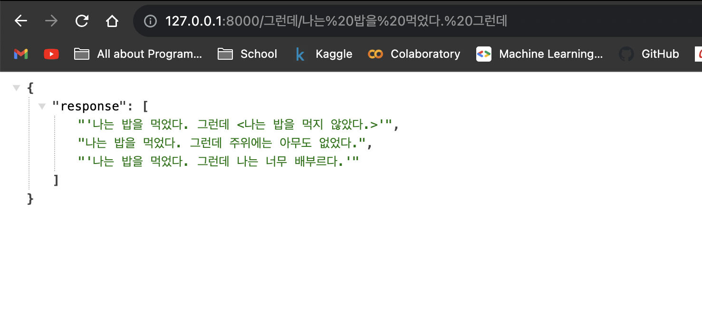

# Sentence Prediction API

### Install Dependencies

> Recommend using `conda`

``` bash
$ conda create -n sentpred
$ conda activate sentpred
$ conda install ipykernel
$ pip install -r requirements.txt
```

### run Server
``` bash
$ uvicorn main:app
```

### API Explanation

`GET /{conj}/{sent}`

+ conj (`str`): 접속사 종류 (`그런데, 그러나, 따라서` 중 택일)
+ sent (`str`): 사용자가 입력한 문장 (ex: 나는 밥을 먹었다.)


## Example

input
+ conj: `그런데`
+ sent: `나는 밥을 먹었다.`
+ API call: `GET /그런데/나는 밥을 먹었다.`


output



## Connection with AWS Server

+ EC2-ubuntu server from AWS
+ elastic IP address: 13.50.75.185
+ API call 부르기: `GET http://13.50.75.185/{conj}/{sent}`
